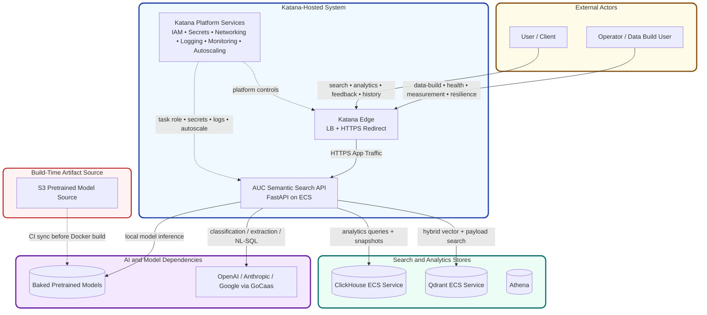
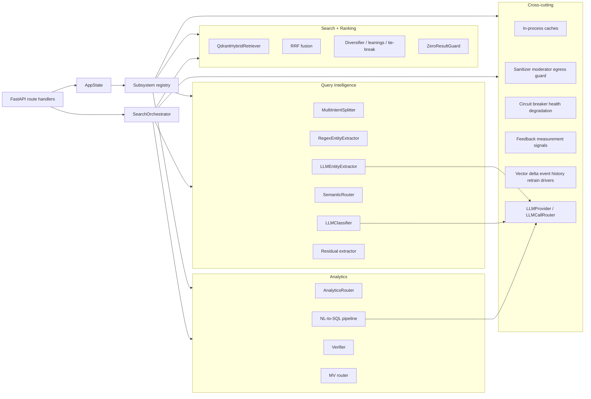
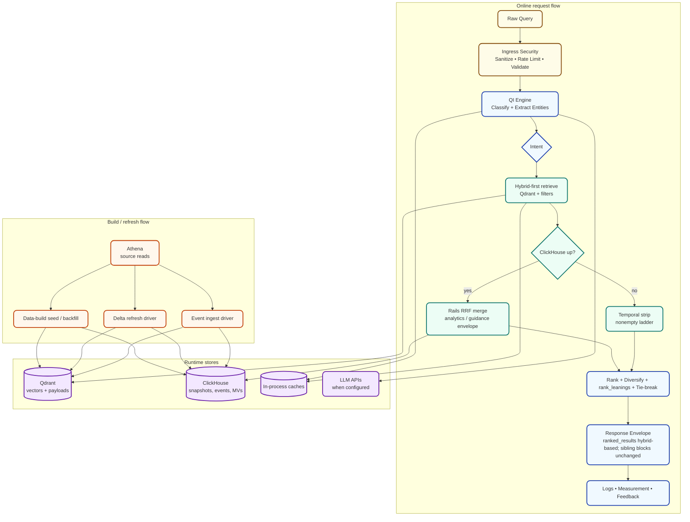
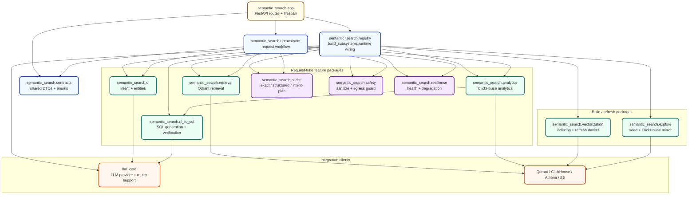
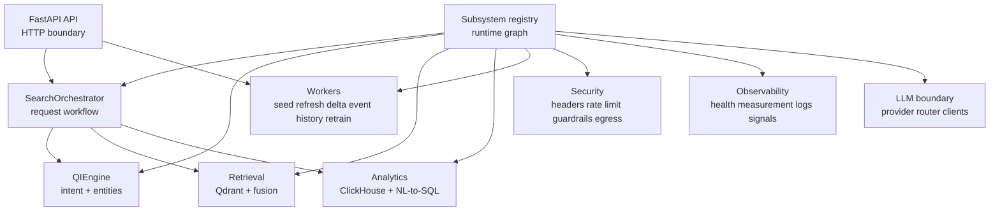

# AUC Semantic Search Architecture

## What This Answers

- Services: API + Qdrant; ClickHouse optional via `clickhouse.enabled` (default `true`). `llm-core` ships inside the API image.
- Connectivity: clients → API → Qdrant / optional ClickHouse-Athena / LLM APIs / baked local models. If ClickHouse is off, CH-backed analytics/explore/price-band paths are disabled; Qdrant/in-memory paths remain.
- Technology: FastAPI/Python, Qdrant, ClickHouse, FastEmbed/hashing/sklearn/spaCy, OpenAI/Anthropic/Google (GoCaas), Docker, Katana ECS.
- Data: Qdrant collections, optional ClickHouse tables, Athena/S3 build paths, baked models, in-process caches, JSONL feedback.
- Security: Katana HTTPS/IAM/secrets plus app headers, rate limits, sanitizers, moderator, egress guard.
- Scalability: Katana ECS replicas/autoscaling, separated stores, external LLMs, timeouts, degradation.

## 1. Context Diagram

## 2. Container Diagram

```mermaid
flowchart TB
    %% =============================================
    %% Styling
    %% =============================================
    classDef local fill:#fefce8,stroke:#854d0e,stroke-width:3px,rx:12,ry:12;
    classDef katana fill:#f0f9ff,stroke:#1e40af,stroke-width:3px,rx:12,ry:12;
    classDef external fill:#f3e8ff,stroke:#6b21a8,stroke-width:2.5px,rx:10,ry:10;

    %% =============================================
    %% Local Development
    %% =============================================
    subgraph DevLocal["Local Development\n(docker-compose via scripts/compose-up.sh)"]
        direction TB
        LocalAPI[agent-search API :8085]
        LocalQdrant[(Qdrant :6333 / :6334)]
        LocalClickHouse[(ClickHouse :8123 / :9000)]
        
        LocalAPI --> LocalQdrant
        LocalAPI -.->|clickhouse.enabled=true| LocalClickHouse
    end

    %% =============================================
    %% Katana Dev Environment
    %% =============================================
    subgraph KatanaDev["Katana dev-private Environment"]
        direction TB
        App[auc-semantic-search ECS App :8085]
        Qdrant[auc-semsearch-qdrant ECS Service :8443]
        ClickHouse[auc-semsearch-clickhouse ECS Service :8443]
        TaskRole[IAM Task Role]
        Secrets[Secrets / Env Vars]
        Logs[CloudWatch Logging]
        Autoscale["CPU/Memory Autoscale (70%)"]
        
        App --> Qdrant
        App -.->|clickhouse.enabled=true in CI| ClickHouse
        App --> TaskRole
        App --> Secrets
        App --> Logs
        Autoscale --> App
    end

    %% =============================================
    %% External Dependencies
    %% =============================================
    LLM[OpenAI / Anthropic / Google]
    Pretrained[(Pretrained Models)]

    %% =============================================
    %% Connections
    %% =============================================
    LocalAPI --> LLM
    App --> LLM
    LocalAPI --> Pretrained
    App --> Pretrained

    %% Apply styles
    class DevLocal local
    class KatanaDev katana
    class LLM,Pretrained external
```

Katana owns load balancers, subnets, HTTP-to-HTTPS redirect, logging, monitoring, security, networking, and IAM policy attachments. Repo files define/publish the ECS artifacts and app-level configuration.

## 3. Layered Architecture

```mermaid
flowchart TB
    %% Larger, cleaner subgraphs
    classDef layer fill:#f0f4f8,stroke:#1e40af,stroke-width:3px,rx:12,ry:12;
    classDef security fill:#fee2e2,stroke:#b91c1c,stroke-width:3px,rx:12,ry:12;
    classDef observability fill:#ecfdf5,stroke:#0f766e,stroke-width:3px,rx:12,ry:12;

    subgraph Business["Business Layer"]
        direction TB
        Personas[Users & Operators]
        Capabilities[Search • Guidance • Explore • Analytics • Feedback]
        ExternalBiz[LLM APIs • Athena • S3]
    end

    subgraph Application["Application Layer"]
        direction TB
        FastAPI[FastAPI Routes]
        Orchestrator[SearchOrchestrator]
        DataBuild[Data-build Endpoints]
        Registry[build_subsystems]
    end

    subgraph AI["AI Layer"]
        direction TB
        QI[QIEngine]
        Extract[Regex + LLM Entity Extraction]
        Router[Semantic Router + LLM Classifier]
        NLSQL[NL-to-SQL + Verifier]
        Eval[Measurement / Eval Hooks]
        AICache[QI + NL-SQL Caches]
    end

    subgraph Data["Data Layer"]
        direction TB
        QdrantData[(Qdrant Vectors + Payloads)]
        ClickHouseData[(ClickHouse Analytics)]
        AthenaData[Athena Read Paths]
        Signals[JSONL + In-memory Signals]
        Models[(Baked Models)]
    end

    subgraph Security["Security Layer"]
        direction TB
        HTTPS[HTTPS Ingress]
        Headers[Security Headers]
        RateLimit[Rate Limiting]
        Guardrails[Sanitizer • Moderator • Egress Guard]
        Scans[Semgrep • Container Scan • DAST]
    end

    subgraph Observability["Observability Layer"]
        direction TB
        Health["/healthz"]
        Measurement["/measurement/*"]
        Resilience["/resilience/health"]
        Logs[Structured Logs + CloudWatch]
    end

    subgraph Infra["Infrastructure Layer"]
        direction TB
        Katana[Katana ECS]
        Docker[Docker Images]
        TaskRole[IAM Task Role]
        Secrets[Secrets / Env Vars]
    end

    %% Flow connections
    Business --> Application
    Application --> AI
    AI --> Data

    Application --> Security
    Application --> Observability

    Infra --> Application
    Infra --> Data

    class Business,Application,AI,Data,Infra layer
    class Security security
    class Observability observability
```

## 4. Component Diagram

## 5. Deployment Diagram

```mermaid
flowchart TB
    %% =============================================
    %% Styling
    %% =============================================
    classDef platform fill:#f0f9ff,stroke:#1e40af,stroke-width:3px,rx:12,ry:12;
    classDef service fill:#ecfdf5,stroke:#0f766e,stroke-width:3px,rx:12,ry:12;
    classDef aws fill:#fefce8,stroke:#854d0e,stroke-width:3px,rx:12,ry:12;
    classDef external fill:#f3e8ff,stroke:#6b21a8,stroke-width:2.5px,rx:10,ry:10;

    %% =============================================
    %% Katana Platform
    %% =============================================
    subgraph Katana["Katana dev-private Platform"]
        direction TB
        LB["Katana Load Balancer<br/>Subnets + HTTPS Redirect"]
        TG["HTTPS Target Group<br/>/healthz"]
        Auto["Autoscale<br/>CPU/Memory 70%"]
        CW[CloudWatch Logging]
        Net["Networking • Security • Monitoring"]
    end

    %% =============================================
    %% API Service
    %% =============================================
    subgraph APIService["auc-semantic-search ECS Service"]
        direction TB
        APIContainer["API Container<br/>2 vCPU / 4 GB RAM"]
        AppCode[semantic_search + llm_core]
        AppModels["/app/pretrained"]
    end

    %% =============================================
    %% Search Store
    %% =============================================
    subgraph SearchStore["auc-semsearch-qdrant ECS"]
        Qdrant["Qdrant HTTPS :8443"]
    end

    %% =============================================
    %% Analytics Store
    %% =============================================
    subgraph AnalyticsStore["auc-semsearch-clickhouse ECS"]
        ClickHouse["ClickHouse HTTPS :8443"]
    end

    %% =============================================
    %% AWS Access
    %% =============================================
    subgraph AWS["AWS Access via Task Role"]
        direction TB
        IAM["IAM Policies<br/>S3 • Athena • Glue"]
        S3[S3 Pretrained Artifacts]
        Athena[Athena]
    end

    %% =============================================
    %% External / Shared
    %% =============================================
    Secrets["Katana Secrets<br/>LLM • Qdrant • ClickHouse"]
    LLM[OpenAI / Anthropic / Google]

    %% =============================================
    %% Connections
    %% =============================================
    LB --> TG
    TG --> APIContainer
    Auto --> APIContainer
    APIContainer --> CW
    APIContainer --> Net
    APIContainer --> Secrets
    APIContainer --> Qdrant
    APIContainer --> ClickHouse
    APIContainer --> IAM
    APIContainer --> LLM
    APIContainer --> AppCode
    APIContainer --> AppModels

    IAM --> S3
    IAM --> Athena

    %% Apply styles
    class Katana platform
    class APIService,SearchStore,AnalyticsStore service
    class AWS aws
    class Secrets,LLM external
```

## 6. Data Flow

## 7. Dependency Diagram

## Component Responsibility Map

## Notes

- Redis is not an active runtime service in the base config. The code has disabled remote cache mirrors for search payloads and NL-to-SQL exact cache. If enabled later, the API would need a reachable Redis/Dragonfly endpoint via env var; PostgreSQL is not involved.
- Background work is implemented as in-process async drivers. No separate queue service is part of the current architecture.
- Katana owns platform concerns: load balancer, subnets, HTTPS redirect, logging, monitoring, security, networking, autoscaling, and IAM policy attachments.

