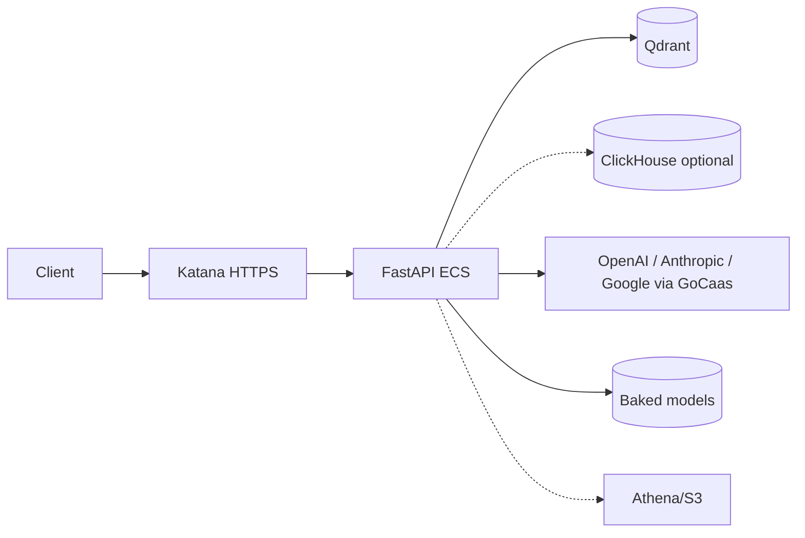
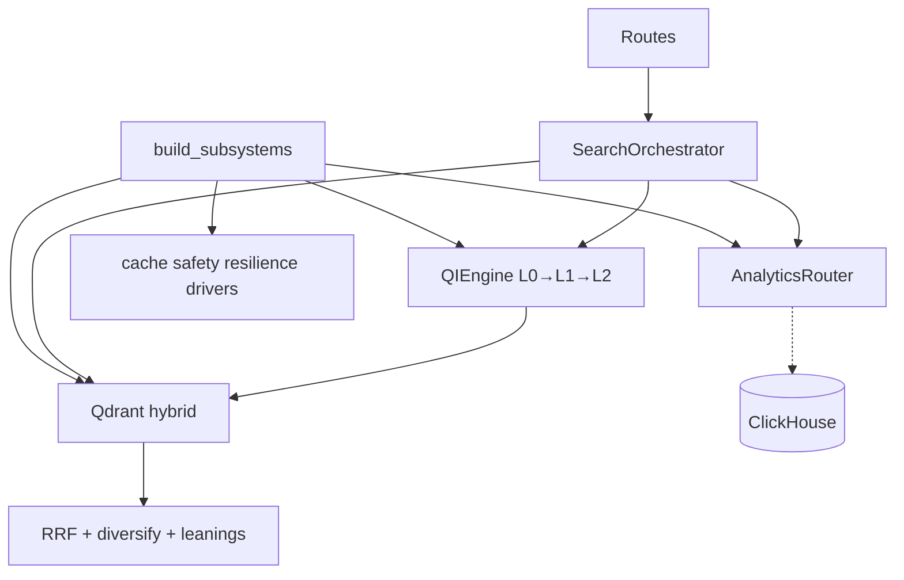
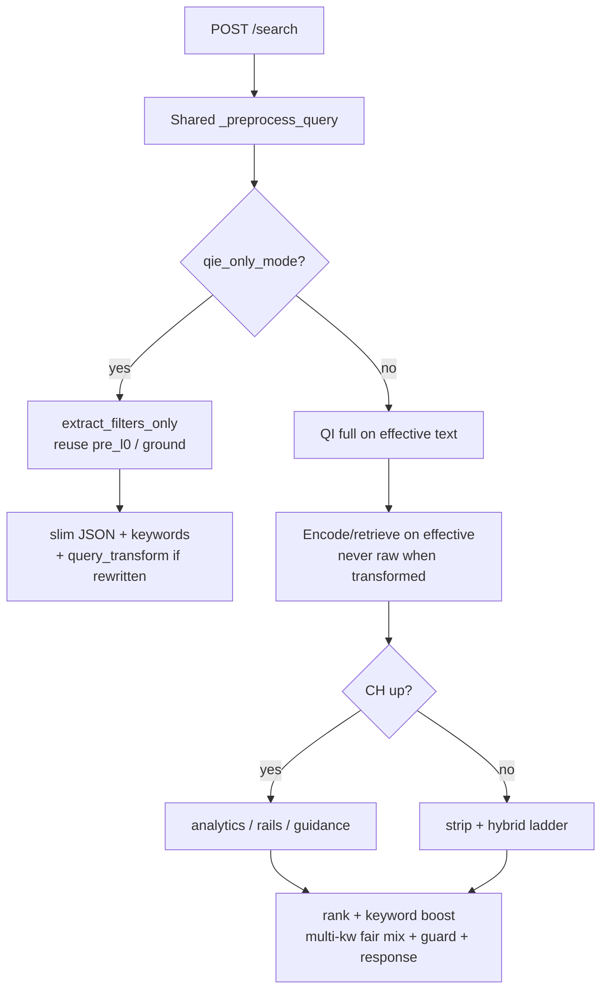

# AUC Semantic Search Design Document

---

## 1. Summary

FastAPI auction search service:

- NL → Query Intelligence (QI) → hybrid-first `ranked_results` via Qdrant.
- ClickHouse optional: analytics / explore rails / guidance / `rank_leanings` complements — never replace listing ranks.
- Operators: data-build, health, cache, measurement, resilience, feedback.

**Degrade:** CH off/down → hybrid still serves (`ranked_results_complement`; temporal strip + nonempty ladder).  
**Runtime:** Katana ECS + Qdrant + optional ClickHouse. Local: Docker Compose. No K8s/Helm/Terraform in repo.

---

## 2. Delivery Phases


| Phase                 | Outcome                                                                               | Hard deps                                                  |
| --------------------- | ------------------------------------------------------------------------------------- | ---------------------------------------------------------- |
| **1** Filters-only UX | `qie_only_mode=true` → grounded `identified_filters`; no retrieve; FIND API unchanged | LLM (or regex-only degrade); no Qdrant/CH                  |
| **2** Semantic search | Hybrid/semantic service; CH complements when ready                                    | Qdrant + index; Kinesis NRT when freshness on; CH optional |
| **3** Continuity      | Saved search, memory, live listing ingest, ranker, fine-tune                          | Streams, identity, prod LLM                                |


Full gates/deps: `PLAN.md`.

---


## 3. Context




Operators hit same API for data-build / health / measurement.

---


## 4. Stack & Layout


| Area      | Tech                                  |
| --------- | ------------------------------------- |
| API       | Python 3.12, FastAPI, Uvicorn         |
| Search    | Qdrant (dense/sparse/payload)         |
| Analytics | ClickHouse (optional)                 |
| Source    | Athena + S3                           |
| LLM       | `LLMProvider` / allowlists ∩ GoCaas   |
| Models    | FastEmbed / baked `/app/pretrained`   |
| Deploy    | Katana ECS; Compose local             |
| CI        | GitHub Actions, Semgrep, pytest, scan |


```text
auc-semantic-search/
  packages/semantic-search/   # app, QI, retrieval, analytics, vectorization
  packages/llm-core/          # LLM client lib (in API image)
  configs/katana*.yaml
  docker/  docker-compose*.yaml
  docs/
```

---


## 5. Boundaries


| Unit                    | Role                                                     |
| ----------------------- | -------------------------------------------------------- |
| API (`semantic_search`) | Routes, orchestrator, QI, retrieval, analytics, feedback |
| `llm-core`              | Provider/client library                                  |
| Qdrant                  | Vectors + payload filters                                |
| ClickHouse              | Analytics / events / MVs (optional)                      |
| Athena/S3               | Seed/backfill + feedback artifacts                       |
| LLM APIs                | L0 extract, L2 classify, NL-to-SQL, verifier             |


---


## 6. Runtime Architecture

Layers: routes → `build_subsystems()` → `SearchOrchestrator` → QI / Qdrant / optional CH → caches, safety, resilience, drivers.




| Component                        | Role                                           |
| -------------------------------- | ---------------------------------------------- |
| `app.py`                         | FastAPI, lifespan, middleware, routes          |
| `registry.py`                    | Wire subsystems                                |
| `SearchOrchestrator`             | Shared preprocess + search / qie_only / rank   |
| `QIEngine`                       | Intent + entities                              |
| `L0LLMFilterExtractor`           | FIND-63 + soft chips + keywords (extract / combined rewrite+extract) |
| `RegexEntityExtractor`           | L0 fallback when LLM unavailable               |
| `QdrantHybridRetriever`          | Dense/sparse/ngram/rerank                      |
| `AnalyticsRouter` + NL-to-SQL    | CH complements                                 |
| `OfflineIndexer` / vectorization | Index + payload                                |
| Drivers                          | Delta refresh, event ingest, history/retrain   |


Diagram depth: `ARCHITECTURE.md`.

---


## 7. Core Flows

Authoritative diagrams: `PROCESS.md`. Short recipes: `PLAYBOOK.md`.

### 7.1 Search

Shared pre-QI for both modes: `SearchOrchestrator._preprocess_query` (spell +
token-gated rewrite+L0 or extract-only). `qie_only` → `extract_filters_only()`;
full search → classify/retrieve on the same effective text. No duplicate
transform/extract pipeline in `app.py`.




| Mode                 | Path                                                  | Result                                                                 |
| -------------------- | ----------------------------------------------------- | ---------------------------------------------------------------------- |
| `qie_only_mode=true` | Same preprocess → L0 ground; no L1/L2/retrieve        | Slim JSON: `request_id`, `identified_filters`, `keywords`, optional `query_transform`, `decision_tier=L0_entity`, `latency_ms`, `decision_cost_usd`, FIND wire. Log: `qie_only_complete` (§12). |
| Full search          | Same preprocess → QI → hybrid-first on effective text | `ranked_results` (+ CH complements when up); `query_intelligence` may include `query_transform` |


**L0 policy (verified):** `combine_rewrite_with_l0_extract` — long queries (`token_count > rewrite_threshold`) → one combined rewrite+extract LLM call (filters/keywords from rewritten text only); short → extract-only. When rewritten: classify/split/encode/retrieve use effective text only (`classify_on_transformed_query`, `encode_from_rewrite`).

**L0 extract contract (G1–G4)** — same for `qie_only` and full search:

| Gate | Requirement |
| ---- | ----------- |
| **G1** | FIND-63 hard filters from catalog; never invent off-catalog params |
| **G2** | Soft/local chips (topics/patterns/phrases/categories) when cued; soft stays off FIND hard wire |
| **G3** | Keywords with `probability`; keep when `>= qi.l0_llm_entity.keyword_min_probability` (percent — sole source for JSON extract, FIND wire query terms, soft rank-boost) |
| **G4** | Price bound + `filterPriceCurrency` together (e.g. `under EUR 80` → `maxPrice=79` + `EUR`) |

Happy path = one structured LLM call. Regex path has no keyword probabilities (N/A). Soft chips + gated keywords feed rank-boost on full search; with 2+ keywords, all-terms-in-name first then fair mix by keyword probability so one term cannot own `top_k` (PROCESS §9). Multi-intent: top-level `filters.identified` is the cross-leg union; per-leg under `sub_intent_filters`. LLM unavailable → regex on raw/normalized (no rewrite). `extract_before_classify` awaits L0 before L1/L2. Regex only when LLM unavailable (or inventory-bound empty success when configured) — no parallel merge into a nonempty LLM extract.

### 7.2 Index & freshness


| Path                   | What                                                                       |
| ---------------------- | -------------------------------------------------------------------------- |
| Seed / data-build      | Athena/S3 → Qdrant upsert; optional CH mirror                              |
| Delta refresh          | Patch mutable Qdrant payload (no re-embed)                                 |
| Kinesis / event ingest | Bid/watch/enrich → CH events/MVs → Qdrant payload (env toggles; soft-fail) |


**Priority inventory (what gets indexed):** Live auctions (`active_only` → `auction_end_utc_ts > now`) in FIND types **16 / 20 / 38 / 39** (GoDaddy AutoExtend, BuyNow/Closeout, Partner AutoExtend, Partner Closeout — `DISCOVERY.md`). Seed defaults: Athena `auction_audit_cln`, `datewise` **14d**, `max_records` **1M** (`vectorization.seed`). Athena seed SQL hard-filters `auction_type_id IN (16,20,38,39)` always, plus live + lookback when `active_only` (`db_seed_source.py`). Query path also drops ended listings (`active_only_baseline`). Bid/watch NRT patches mutable payload — not seed membership. Expand types only with product.

**NRT source:** Reuse Auctions/FIND event streams (FIND already consumes). Phase 2: learn contracts with Auctions, then Lambda consumer into our paths. Drivers default off until enabled; search still serves from indexed payloads when ingest is off.

### 7.3 Ranking

Hybrid RRF → diversify → optional CH `rank_leanings` reorder → auction tie-break → zero-result ladder → egress guard.

---


## 8. API Surface

App: `semantic_search.app:app`. Rate limit: `X-Session-Id` or IP. Subsystems missing → 503.


| Endpoint                  | Purpose                                  |
| ------------------------- | ---------------------------------------- |
| `GET /healthz`, `/health` | Liveness                                 |
| `GET /capabilities`       | Subsystem snapshot                       |
| `POST /search`            | Search / qie_only / analytics routes     |
| `POST /feedback`          | UAT write (comment, preferred `search_id`, optional `query` / `request_id`); `X-Feedback-Key` when provisioned |
| `GET /feedback`           | Operator CSV export from S3 (`date_from`/`date_to`, default 7d); not Auction runtime |
| `GET/POST /cache/*`       | Stats / clear                            |
| `GET /resilience/health`  | Backend health                           |
| `GET /measurement/*`      | Observations / signals                   |
| `POST /data-build/seed    | full                                     |
| `GET /data-build/status`  | Data-layer status                        |


`/search` timeout → fallback envelope. Detail: `PLAYBOOK.md` §11, `PROCESS.md` §11.

Feedback: POST = UX/UAT write keyed by durable `search_id` (trace `request_id` optional); GET = operator S3 CSV export. Phase 1 loop: UX posts with `search_id` from `/search`; offline GET/logs as backup (`PLAYBOOK.md` §13). Identity knobs: `identity.*` in `base.yaml`.

**`qie_only` response:** `identified_filters` = `[{name, value, source}, …]` — FIND API param names (63 filterables from `find_api_params.json` via `slot_to_api_param.py`) or soft/local chips; not internal slots (`tld` → `tldIncludeList`, `price_max` → `maxPrice`). `source` = `L0_llm` \| `L0_llm_cache` \| `L0_regex`. Also: `keywords`, optional `query_transform` when rewrite accepted, FIND wire fields. Sample + table: `PLAYBOOK.md` §3.

---


## 9. Data

**Contracts:** `Entity`, `IntentSlice`, `QueryIntent`, `Candidate`/`CandidateSet`, `RankedItem`/`RankedResults`, caches, feedback/measurement records (`contracts.py`).


| Store                      | Content                                                             |
| -------------------------- | ------------------------------------------------------------------- |
| Qdrant `auctions_listings` | Dense/sparse (+ optional rerank/ngram), on-disk payload             |
| ClickHouse                 | `auction_audit_cln`, events, MVs, feedback/snapshots (when enabled) |
| In-process                 | Exact / structured / intent-plan caches; signal ring (FIFO 5000)    |
| JSONL / S3                 | Append JSONL + UAT day-partitioned S3 CSV; see `PLAYBOOK.md` §13    |

Signals: ring = hot buffer (no TTL); JSONL = local append (no app rotation); UAT S3 = durable SoT for `uat_feedback`. Knobs: `feedback.*` in `base.yaml` (`signal_store.py`).

---


## 10. Integrations


| System              | Use                   | Failure mode                              |
| ------------------- | --------------------- | ----------------------------------------- |
| Qdrant              | Retrieve + index      | Soft-fail construct; typed query errors   |
| ClickHouse          | Complements + events  | Skip complements; hybrid continues        |
| Athena/S3           | Seed/backfill         | Bounded poll; missing creds fail build    |
| LLM APIs            | QI / extract / NL-SQL | Fallback chain + breaker                  |
| Kinesis (+ drivers) | NRT Qdrant/CH (Auctions/FIND streams → Lambda) | Toggles / soft-fail; static index remains |
| eRanker             | L4 rerank             | Base config `noop`                        |


---


## 11. Config & Deploy


| Source                    | Role                                         |
| ------------------------- | -------------------------------------------- |
| `config/base.yaml`        | Behavior, timeouts, store flags, rate limits |
| `configs/katana*.yaml`    | ECS env/secrets intent                       |
| Compose + `compose-up.sh` | Local; CH gated by `clickhouse.enabled`      |


| Knob              | Value           |
| ----------------- | --------------- |
| Search SLA        | 10s             |
| Analytics budget  | 20s             |
| Search rate       | 120/min + burst |
| Qdrant read TO    | 3.5s            |
| CH exec / read TO | 5s / 6.5s       |
| Per-query LLM cap | `$0.05` (`cost_budget.max_cost_usd_per_query`) |
| Fleet LLM cap     | `$25/h` / `$100/day` UTC (`cost_budget.fleet`) |


| Service    | Ports                  | Replicas (dev/Test/Prod) |
| ---------- | ---------------------- | ------------------------ |
| API        | HTTPS 8085, `/healthz` | 1 / 2 / 3                |
| Qdrant     | HTTPS 8443 internal    | 1 / 1 / 2                |
| ClickHouse | HTTPS 8443 internal    | 1 / 1 / 1                |


CI: push→dev-private; manual promote Test/Prod. Topology: `INFRASTRUCTURE.md`.

**Phase 1–2 LLM model selection:** Primary = first *discovered* id in
`model_selection_strategy.task_model_allowlists` for
`query_intent_classification` / `l0_entity_extraction` / `query_rewrite`
(shared preference: gemini-2.5-flash-lite → gpt-5.4-mini →
claude-haiku-4-5-20251001 → gpt-4o-mini). Keys: `ANTHROPIC_API_KEY`,
`OPENAI_API_KEY`, `GOOGLE_API_KEY` (`llm_api_keys` in `base.yaml`). Caps above
enforce spend; owner = MLE. Log `model_id` / `decision_cost_usd`; refine fleet
estimates from live p50 after launch.

---


## 12. Security & Observability

**In place:** Katana HTTPS; runtime TLS on API/Qdrant/CH; security headers; rate limits; sanitizers; moderator/egress; LLM breaker; Semgrep + image scan.

**Limits:** App auth only verified for feedback key; `/search` and data-build have no in-app authz; Qdrant API key / CH password TODOs in manifests; no Prometheus/OTel SDK in this repo (Phase 2).

**Ops signals:** `/healthz`, `/capabilities`, `/resilience/health`, `/measurement/`*, search metrics in response. Log shipping + CW retention = platform-owned.

**Alerts:** [`OBSERVABILITY.md`](OBSERVABILITY.md) — **boundaries:** code = emit (logs/probes); this doc = alarm names/filters only; platform = CW wire. No in-repo CW alarms. Thresholds: `base.yaml`. Summary: `PLAYBOOK.md` §12.

**qie_only success log** (`qie_only_complete`, INFO on `semantic_search.app`): `request_id`, `query_len`, `latency_ms`, `decision_tier`, `filter_count`, `source` (`L0_llm` / `L0_regex`), `model_id`, `token_count`, `decision_cost_usd`, `grounded_drop_count` (0 on this path). The same `request_id` is in the HTTP body. Sanitizer / LLM-unavailable paths also log `request_id`.

---


## 13. Performance Notes

- Hybrid over-fetch ×4; encoder coalesce ~8ms; multi-tier QI/search caches (Redis remote off in base).
- Static ECS replicas; no verified autoscaling policy artifact in this repo.
- Backend health can drop/degrade retrieval legs.

--

## 14. Readiness


| Ready                                     | Gap                                            |
| ----------------------------------------- | ---------------------------------------------- |
| API + QI + hybrid + optional CH path      | No K8s/Helm/Terraform                          |
| Katana manifests + GHA deploy             | Alert **docs** in `OBSERVABILITY.md`; CW alarms outside repo |
| TLS, rate limit, sanitizers, breakers     | Qdrant/CH secret TODOs; PV mounts not verified |
| Phase 1 `qie_only` + Phase 2 degrade path | Test/Prod CI account IDs blank in config       |


**Also:** in-process drivers (no queue service); eRanker/retrain/synonyms off in base; `QdrantClientFactory.aclose()` unused on shutdown.

---


## 15. References

Docs: `DISCOVERY.md` · `PLAN.md` · `ARCHITECTURE.md` · `PROCESS.md` · `PLAYBOOK.md` · `INFRASTRUCTURE.md` · `EVALUATION.md`

Review packet (stakeholder sign-off): `REVIEW_PACKET.md` · `REVIEW_MLS.md` · `REVIEW_MLE.md` · `DECISIONS.md`

Code: `app.py`, `registry.py`, `orchestrator.py`, `contracts.py`, `qi/`, `retrieval/`, `analytics/`, `vectorization/`, `config/base.yaml`

Deploy: `configs/katana*.yaml`, `docker-compose*.yaml`, `.github/workflows/`

QA: see [`EVALUATION.md`](EVALUATION.md) — Phase 1 filter-accuracy harness (`reground_filters_four_way.py`), Phase 2 hybrid/explore/guidance/analytics eval (`eval_test_search_queries.py`), Phase 3 status

---

