# Infrastructure and Deployment

## 1. Runtime Topology

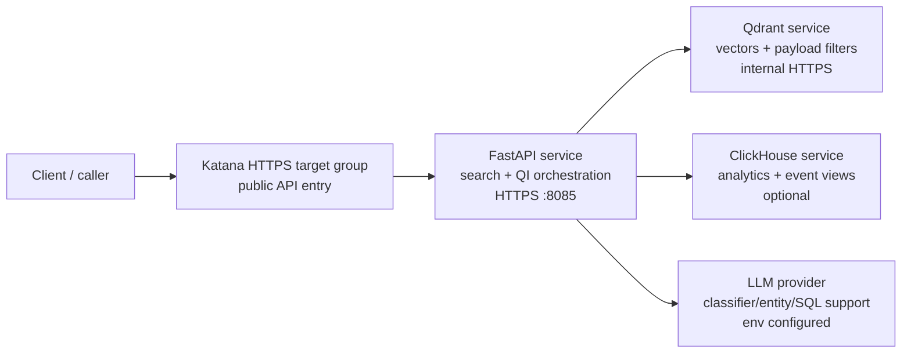

Evidence: `configs/katana*.yaml`, `docker-compose*.yaml`, `base.yaml`.

## 2. Deployment Shape

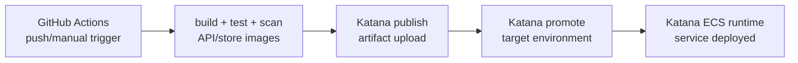

Evidence: `.github/workflows/*.yml`, `.github/workflows/config.json`, `configs/katana*.yaml`.

## 3. Service Runtime

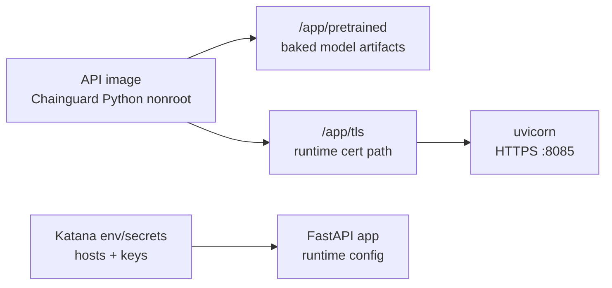

Evidence: `packages/semantic-search/Dockerfile`, `tls_entrypoint.py`, `configs/katana.yaml`.

## 4. Local Runtime

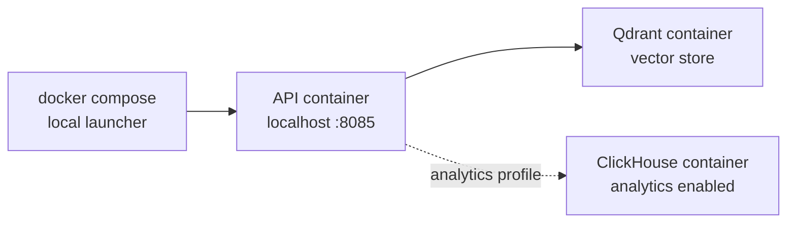

Evidence: `scripts/compose-up.sh`, `scripts/read_clickhouse_enabled.py`, `docker-compose.yaml`, `docker-compose.analytics.yaml`.

## 5. Scalability

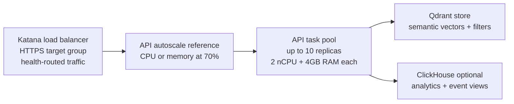

Evidence: `configs/katana.yaml`, `configs/katana-qdrant.yaml`, `configs/katana-clickhouse.yaml`, `ARCHITECTURE.md`, `plan_agentic_search.md`.

## 6. Networking and Discovery

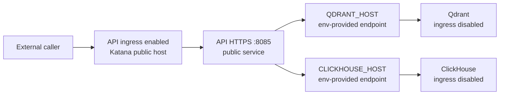

Evidence: `configs/katana*.yaml`, `docker-compose.yaml`, `base.yaml`.

## 7. Configuration and Secrets

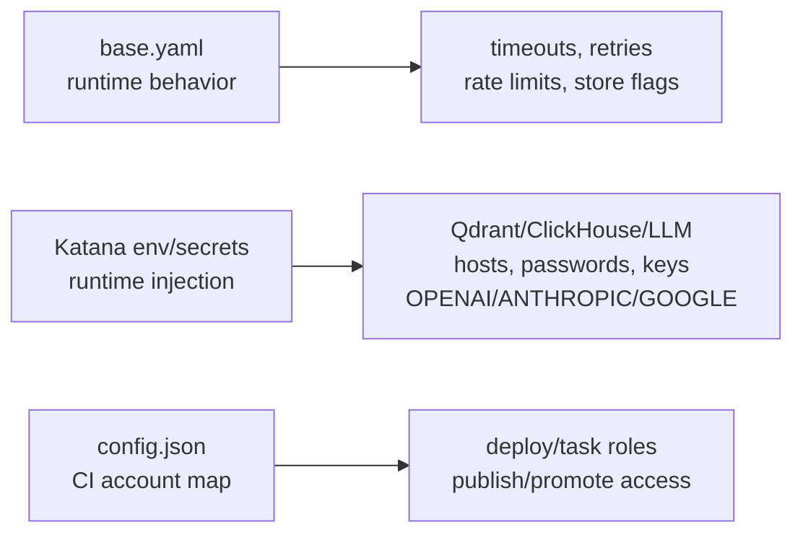

Evidence: `base.yaml`, `config/clickhouse_lever.py`, `configs/katana.yaml`, `.github/workflows/config.json`.

Batch ingest schedule: `vectorization.seed.schedule` and
`.github/workflows/data-ingest.yml` (daily cron + manual dispatch).
Environment: `SEED_SCHEDULE_RUN_ON_DEPLOY`, `SEED_SCHEDULE_INTERVAL_HOURS`,
`SEED_SCHEDULE_RUN_AT_HOUR_UTC` (Katana or local `.env`; restart the task to
apply). Effective values: `GET /data-build/status` → `seed.schedule`.

## 8. Security

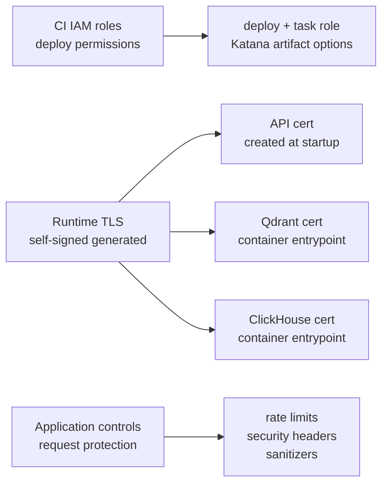

Evidence: `tls_entrypoint.py`, `docker/qdrant/entrypoint-tls.sh`, `docker/clickhouse/entrypoint-tls.sh`, `clickhouse-config/tls.xml`, `base.yaml`.

## 9. Observability Ownership

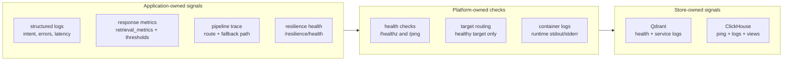

Evidence: `configs/katana*.yaml`, `base.yaml`, `docker-compose.yaml`.

## 10. Resilience

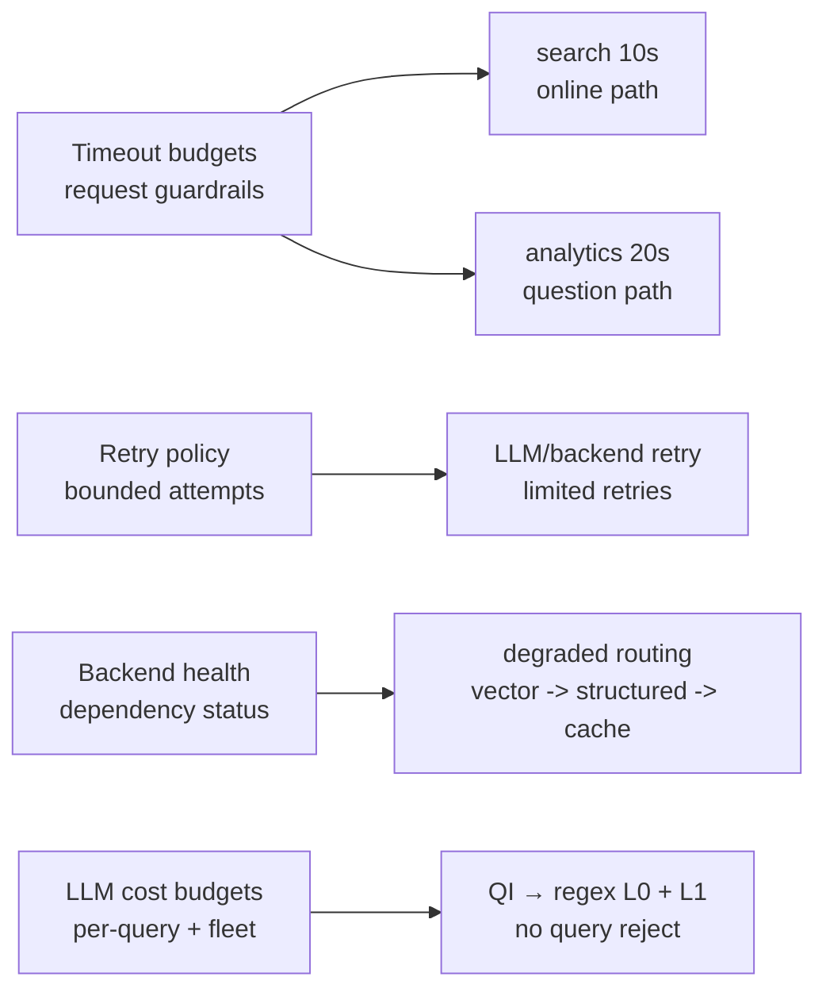

**Cost controls:** per call + hour/day USD, memory|redis. Breach → LLM skipped, search continues via regex/L1. Analytics → `cost_budget_exceeded`. Rates: `packages/llm-core/llm_core/pricing.yaml`.

Evidence: `base.yaml`, `cost/query_budget.py`, `cost/fleet_budget.py`. ClickHouse optional: toggle off, skip deploy, or runtime unavailability. 

## 11. Storage

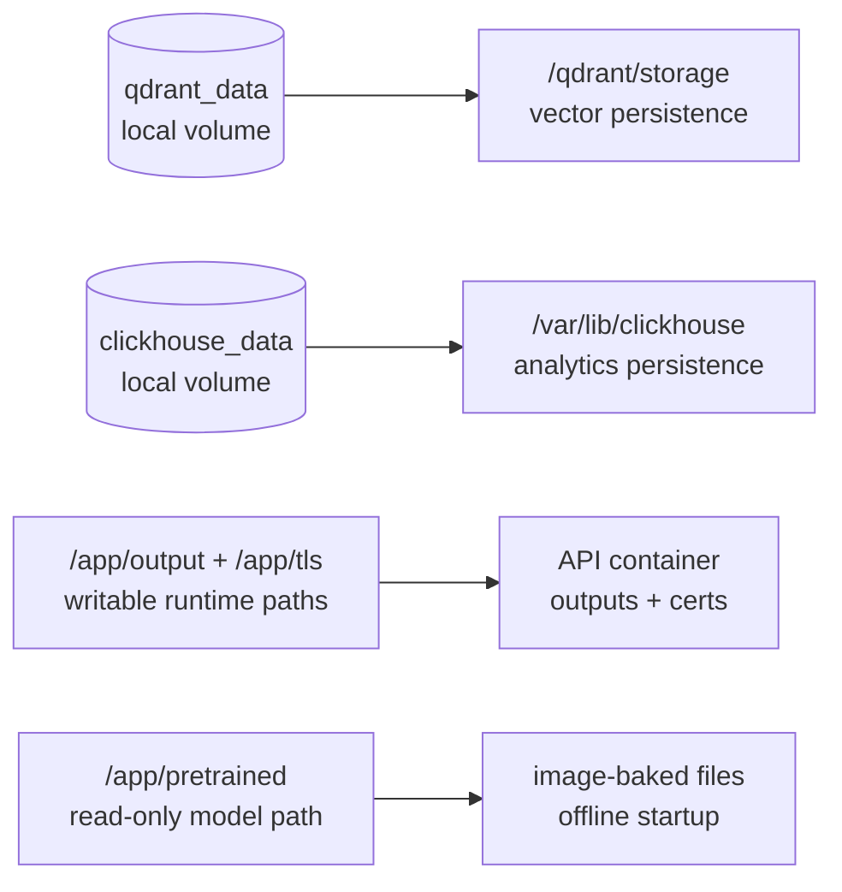

Evidence: `docker-compose.yaml`, `configs/katana-qdrant.yaml`, `configs/katana-clickhouse.yaml`, `packages/semantic-search/Dockerfile`.