# AUC Semantic Search Process Flow

## 1. End-To-End Flow

Both legs share one pre-QI pipeline (`SearchOrchestrator._preprocess_query`):
normalize → optional spell → token-gated combined rewrite+L0 extract (or extract-only).
No separate transform/extract stack for `qie_only` vs full search.

```mermaid
flowchart LR
    Query[Raw user query] --> Guard[Guardrails<br/>sanitize rate limit validate]
    Guard --> Pre[Shared preprocess<br/>spell + token-gated<br/>rewrite+L0 or extract-only]
    Pre --> Mode{qie_only_mode?}

    Mode -->|true| L0Only[extract_filters_only<br/>reuse pre_l0 / L0 ground<br/>no L1/L2 / no retrieve]
    L0Only --> Slim[Slim qie_only JSON<br/>identified_filters + keywords<br/>+ query_transform when rewritten]

    Mode -->|false| QI[Full QI on effective text<br/>split → L1 → L2 / ensemble]
    QI --> Encode[Encode/retrieve on effective<br/>transformed text only when rewritten]
    Encode --> HybridFirst[Hybrid-first retrieve<br/>Qdrant + filters + keyword boost]
    HybridFirst --> Complement{ClickHouse up?}
    Complement -->|yes| Merge[Optional rails RRF merge<br/>analytics block / guidance envelope]
    Complement -->|no| Strip[Temporal strip + hybrid only<br/>nonempty ladder]
    Merge --> Ranking[Rank + rerank + diversify]
    Strip --> Ranking
    Ranking --> Response[Response envelope<br/>ranked_results always hybrid-based]
    Slim --> Measure[Measurement + feedback + resilience]
    Response --> Measure
```

| Path                                                      | Purpose                                                               | Result                                                                                                                             |
| --------------------------------------------------------- | --------------------------------------------------------------------- | ---------------------------------------------------------------------------------------------------------------------------------- |
| `qie_only_mode=true` (Phase 1)                            | Same preprocess as full search; L0 ground only (no intent / retrieve) | Slim `identified_filters` + `keywords` + optional `query_transform`                                                                |
| `hybrid` / `explore` / `guidance` / `analytics` (Phase 2) | Same preprocess → full QI → hybrid-first retrieve on effective text   | Listings always; plus `analytics` / `guidance` / rail merge when CH up; `rank_leanings` may reorder listings from those aggregates |
| saved searches (Phase 3)                                  | persist and replay intent                                             | alerts / resumed search                                                                                                            |
| SLM path (Phase 3)                                        | lower-cost tuned model path                                           | optimized QI / LLM calls                                                                                                           |

## 2. Query Intelligence (Intent Engine)

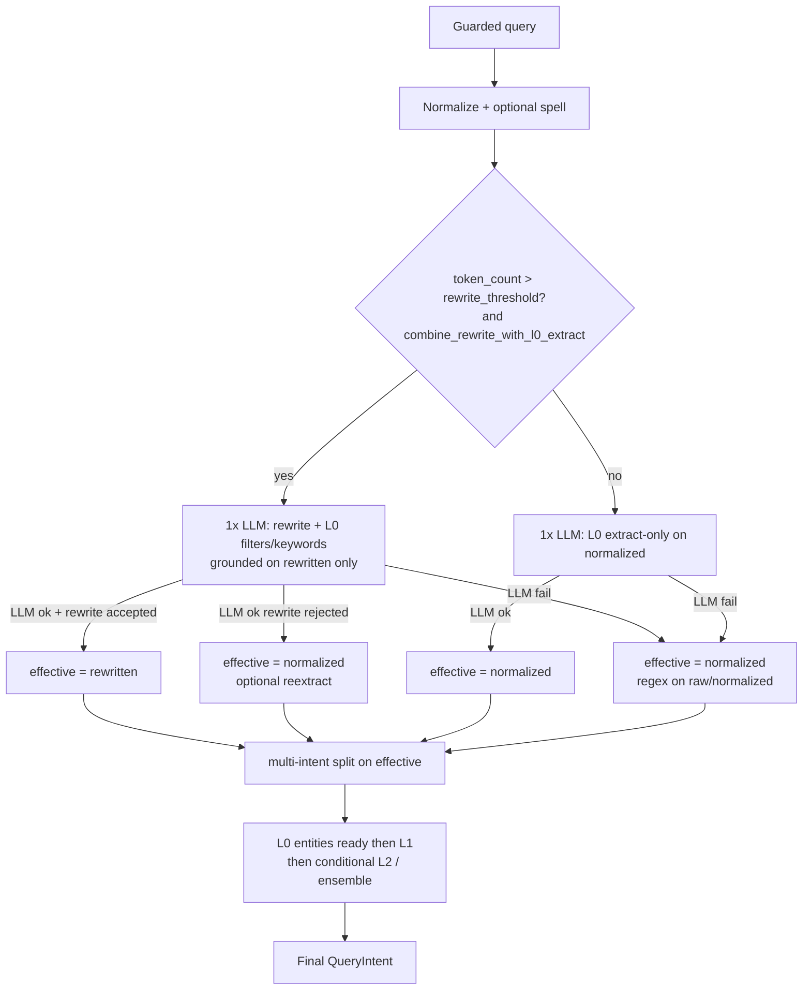

**Happy path = one structured LLM call for rewrite/extract** (`qi.query_transformer.combine_rewrite_with_l0_extract`). Token gate picks prompt/schema:

| Token count           | LLM call                 | Filters / keywords grounded on  |
| --------------------- | ------------------------ | ------------------------------- |
| ≤ `rewrite_threshold` | Extract-only L0          | Normalized / passthrough        |
| > `rewrite_threshold` | Combined rewrite+extract | Rewritten query (same response) |

Shared contract for **both** `qie_only` and full search:

- Entry: `SearchOrchestrator._preprocess_query` (spell + token gate). Combined rewrite skips standalone `QueryTransformer.transform`.
- When rewrite accepted: `effective` = rewritten; `query_transform` attached (`mode`, `engine`, `transformed=true`, `transformed_query`). Downstream QI / multi-intent split / L0 reuse / ANN encode / retrieve use **effective only** — never raw when transformed (`classify_on_transformed_query`, `encode_from_rewrite`).
- L0 extract quality gates (prompt contract, same path for both legs):

| Gate   | Requirement                                                                                                                                                                          |
| ------ | ------------------------------------------------------------------------------------------------------------------------------------------------------------------------------------ |
| **G1** | FIND-63 hard filters — emit every cued hard param from the catalog; never invent off-catalog params                                                                                  |
| **G2** | Soft/local chips — topics, patterns, phrases, categories (`topic_`*, `keyword_*`, lifecycle, …) when cued; keep soft out of FIND hard wire                                           |
| **G3** | Keywords — topical niche terms with `probability` in [0,1]; keep when `>= qi.l0_llm_entity.keyword_min_probability` (percent YAML; sole source for JSON, FIND wire, soft rank-boost) |
| **G4** | Price+currency pairing — numeric price bound **and** `filterPriceCurrency` together (e.g. `under EUR 80` → `maxPrice=79` + `filterPriceCurrency=EUR`)                                |

- Happy path = **one** structured LLM call (token gate picks extract-only vs combined). Multi-intent keyword legs fan out with `asyncio.gather`; no second extract LLM per leg when `pre_l0` is present.
- Regex path has **no** keyword probabilities (N/A — not a silent 50%).
- Full search: keyword terms (same G3 gate) feed soft rank-boost and FIND wire `query`. Multi-intent split runs on effective (transformed) text for multi-leg SERP.
- Multi-intent filters in the response: top-level `filters.identified` = **union** of hard params across legs (dedupe by name+value). Per-leg identified lives only under `sub_intent_filters[].identified` — not duplicated at the top.
- `extract_before_classify`: L0 finishes before L1/L2. LLM unavailable → regex on raw/normalized; no rewrite from that failed path. Combined tags: `qi.l0_llm_entity.combined_prompt_tag` / `combined_schema_version`.

Note: semantic cache miss ≠ "semantic search = no." It only means no cached paraphrase intent; QI continues.

## 3. QI-Only Mode (Phase 1: Filters Identification)

Same preprocess as full search. API must not run a second transform/extract stack —
call `SearchOrchestrator.extract_filters_only()` (which calls `_preprocess_query` then
`QIEngine.extract_l0_filters`, reusing `pre_l0` when the combined call already ran).

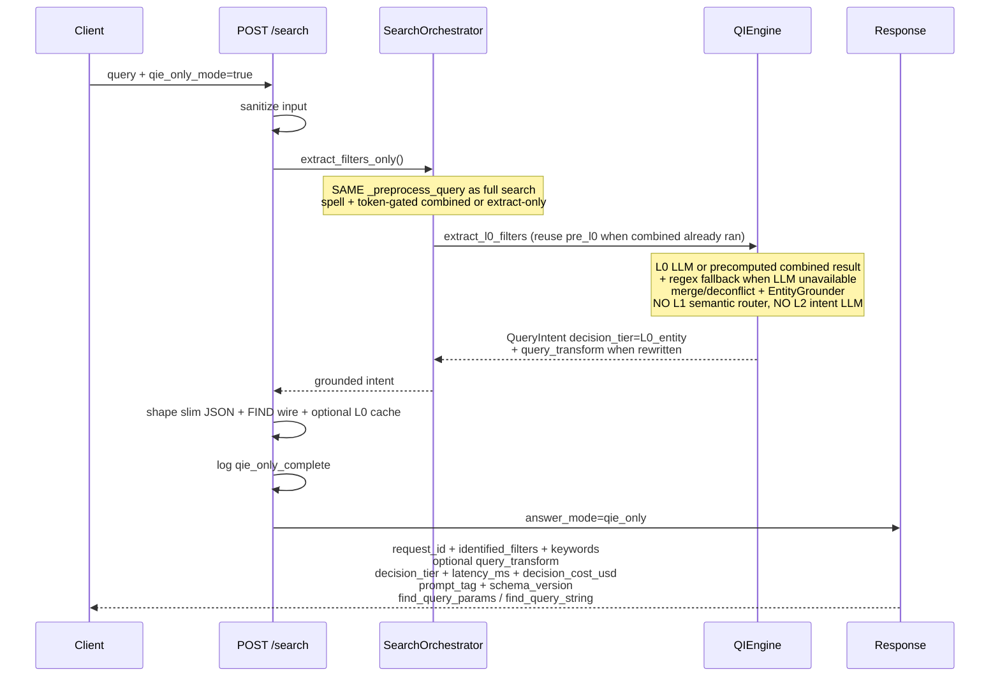

L0 only (regex when LLM unavailable). Skips L1/L2 and retrieval. Token gate +
`combine_rewrite_with_l0_extract` identical to §2. Cache keys use
`combined_prompt_tag` / `combined_schema_version` when rewrite accepted; else
extract-only tags. LLM cache key = `normalize_query` + L0 versions (regex not
cached). Success → `qie_only_complete` (`PLAYBOOK.md` §3, `DESIGN.md` §12).
FIND binary ranking unchanged; FoS consumes FIND wire fields from this response.

## 4. Domain Vectorization And Indexing (Data ingestion)

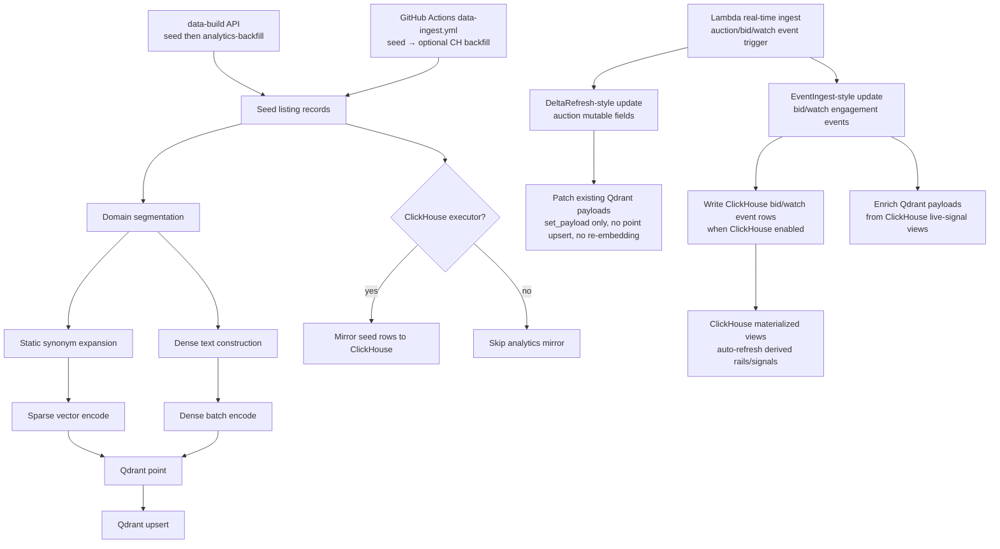

Schedule fields live in `vectorization.seed.schedule` (`base.yaml`). The ingest
workflow reads effective values from `GET /data-build/status` after `/healthz`.

| Env var                         | Effect                                |
| ------------------------------- | ------------------------------------- |
| `SEED_SCHEDULE_RUN_ON_DEPLOY`   | allow `workflow_call` trigger=deploy  |
| `SEED_SCHEDULE_INTERVAL_HOURS`  | minimum hours between scheduled fires |
| `SEED_SCHEDULE_RUN_AT_HOUR_UTC` | UTC hour for scheduled fire           |

Set with `gdx katana envvar set` + `env sync`, or local `.env`, then restart the
task. With `in_process: false`, only the GitHub Actions workflow runs scheduled
builds. See `.github/workflows/data-ingest.yml`, `scripts/read_seed_schedule.py`.

**CI vs ingest (decoupled):** `ci-deploy.yml` ends after API / Qdrant / optional
ClickHouse **promote**. Seed is **not** a CI job — deploy stays green when
packaging succeeds; index freshness comes from the daily cron or manual dispatch.

**Ingest triggers** (`.github/workflows/data-ingest.yml`):

| Trigger         | Cron / event                 | Behavior                                                     |
| --------------- | ---------------------------- | ------------------------------------------------------------ |
| Daily freshness | `0 2 * * *` (`trigger=cron`) | hour/interval gates vs `last_build`; phase=all               |
| Manual          | `workflow_dispatch`          | optional `force_run`                                         |

Order inside ingest: Qdrant `POST /data-build/seed` first; ClickHouse `POST /data-build/analytics-backfill` only if lever on and Qdrant OK.
`seed_mode: rebuild` deletes collection `auctions_listings` before reload (`_clear_for_rebuild`). Prefer EFS at `/qdrant/storage` on Katana Qdrant (see `configs/katana-qdrant.yaml`) so promote does not wipe the index.

| Ingestion path          | Purpose                                                                                                              |
| ----------------------- | -------------------------------------------------------------------------------------------------------------------- |
| data-build API          | `POST /data-build/seed` (Qdrant); `POST /data-build/analytics-backfill` (CH)                                         |
| GitHub Actions ingest   | separate from CI: daily cron + manual; seed then CH if enabled. Ingest failure → **ingest** workflow RED (not CI)    |
| Lambda real-time ingest | delta payload patches and bid/watch event ingest                                                                     |

## 5. Hybrid Retrieval

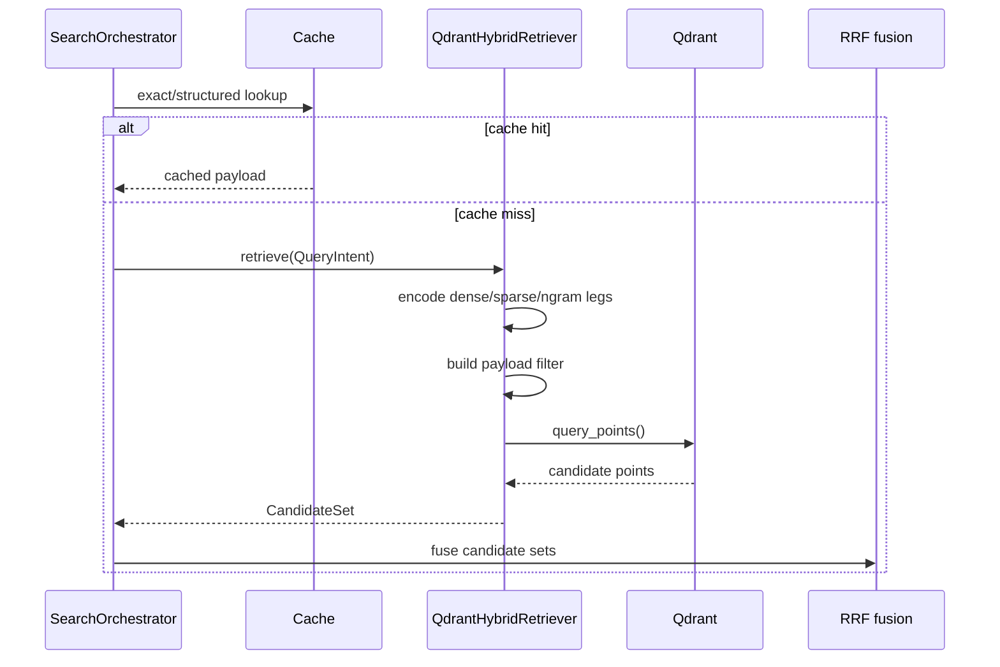

## 6. Fallback Paths

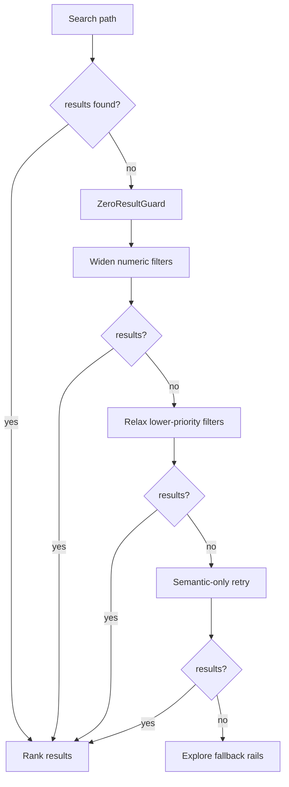

## 7. Mutable Field Refresh

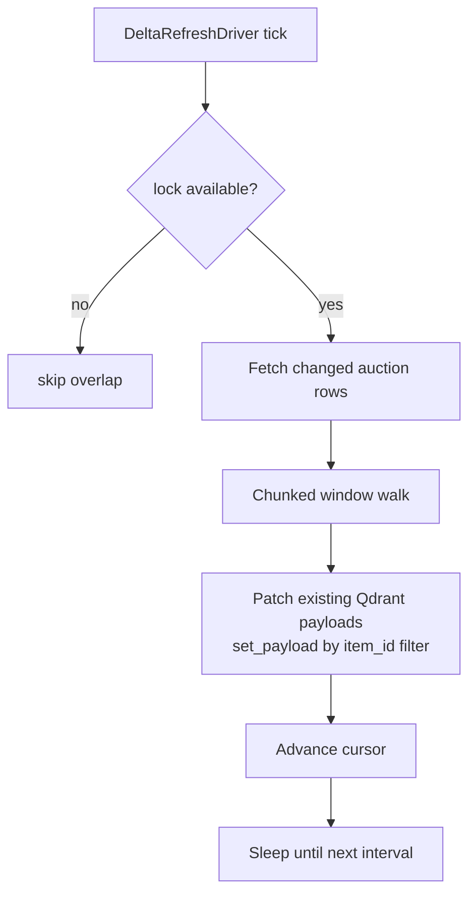

Refreshed mutable fields: `price`, `bid_count`, `auction_type`, `ends_at`, plus configured mutable payload fields. Vectors are not re-embedded. This driver patches existing Qdrant points; full point creation/upsert stays in the data-build/indexing path.

## 8. Event Ingest And Live Signals

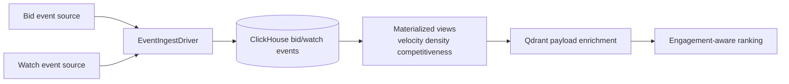

| Signal                    | Meaning                               | Used By                          |
| ------------------------- | ------------------------------------- | -------------------------------- |
| `bid_velocity_1h`         | bids in recent 1h window              | trending, ranking boost          |
| `watch_density_1d`        | active watches today                  | opportunity rails, ranking boost |
| `bidder_watch_density_1d` | bidder-intent watches today           | ranking boost                    |
| `engagement_ratio`        | bidder-watch density vs watch density | ranking boost                    |

## 9. Ranking And Reranking

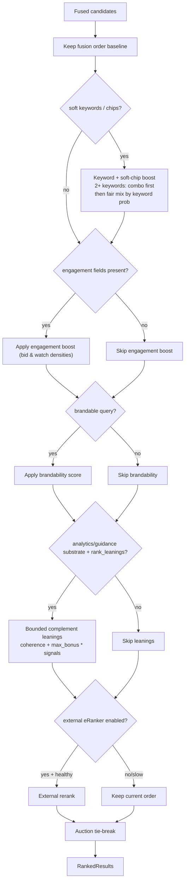

**Soft keywords (full search, G3):** after retrieve/truncate, matching SLD names get a soft boost (not hard filters). With **two or more** gated keywords, order prefers domains that contain **all** terms, then **fairly mixes** single-term hits so the highest-probability keyword cannot fill the whole `top_k` (e.g. coffee + pizza both surface). Soft chips (`topic_`*, `keyword_*`, …) still boost the same stage. Trace: `pipeline_trace.applied_keywords` (roles `encode` / `soft_boost`; omits terms already listed as soft signals).

Post-slim order: soft keyword/chip boost → complement `rank_leanings` (when CH analytics/guidance payload present) → auction tie-break. 

## 10. Analytics Query

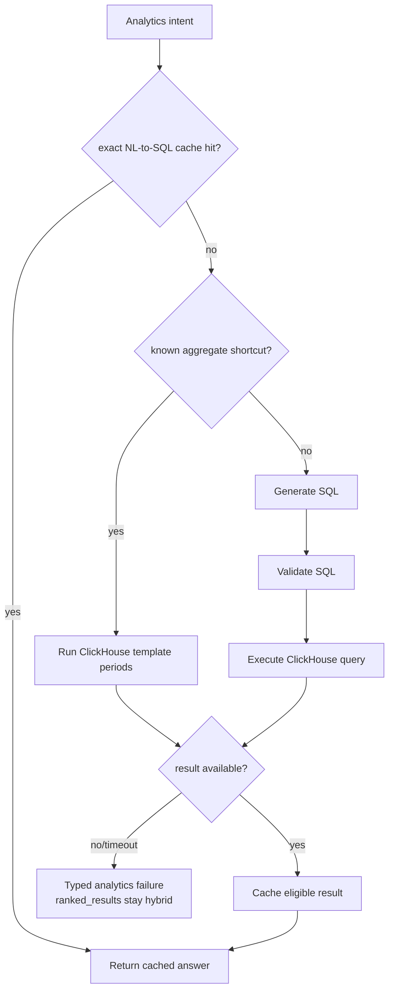

If ClickHouse is toggled off, not deployed, or unavailable at runtime: skip analytics SQL / explore rail merge / guidance snapshot / `rank_leanings`. `ranked_results` still come from hybrid-first Qdrant retrieve (`ranked_results_complement`, temporal strip + nonempty ladder). 

## 11. Response Composition

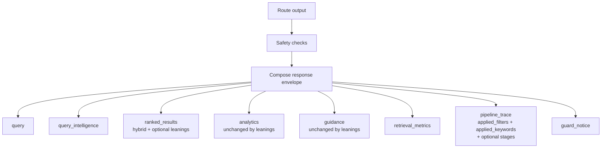

`pipeline_trace`: always `applied_filters` + `ranked_results_role`; `applied_keywords` when L0 keywords drove encode and/or soft boost; optional `stages` when `measurement.ranking_stage_attribution.include_in_response` (log token `ranking_stage_attribution`). Multi-intent: see §2 (union identified + per-leg `sub_intent_filters`).

## 12. Measurement And Resilience

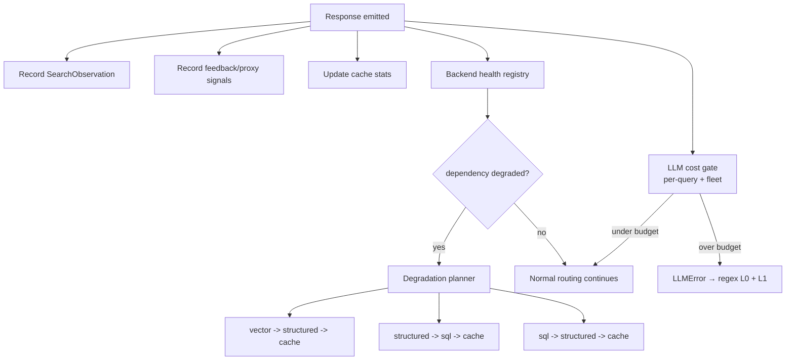

Cost: `cost_budget` (per-query USD + fleet hour/day). Search never empty-rejects on spend; analytics may return `cost_budget_exceeded`.

## 13. Feedback Signals And Optional Retraining

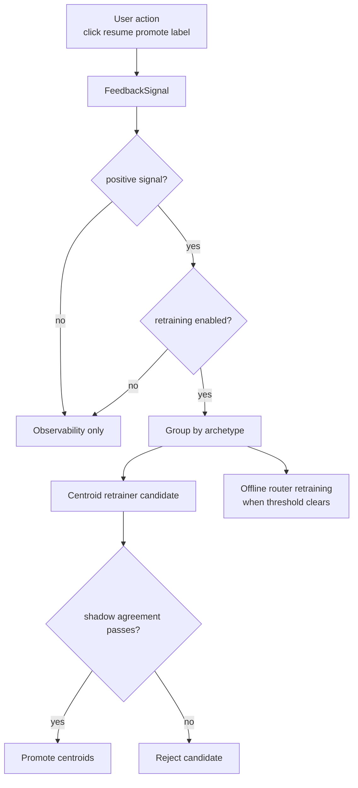

Boundaries: retraining is optional/config-driven. Positive signals do not update confidence calibration; golden calibration seeds remain separate from traffic-derived seeds.

## 14. Error And Retry Flow

**LLM model chain:** `LLMProvider.get_fallback_chain(task)` =
`task_model_allowlists.<task>` ∩ GoCaas discovery (preference order preserved).
Primary = chain[0] (`get_primary_model`). Empty chain → fail loud / degrade.
Keys from `llm_api_keys` (`OPENAI_API_KEY`, `ANTHROPIC_API_KEY`, `GOOGLE_API_KEY`).
Offline harness LLMJ uses the same extraction primary unless `L0_GROUNDING_MODEL`
overrides — see `[EVALUATION.md](EVALUATION.md)`.

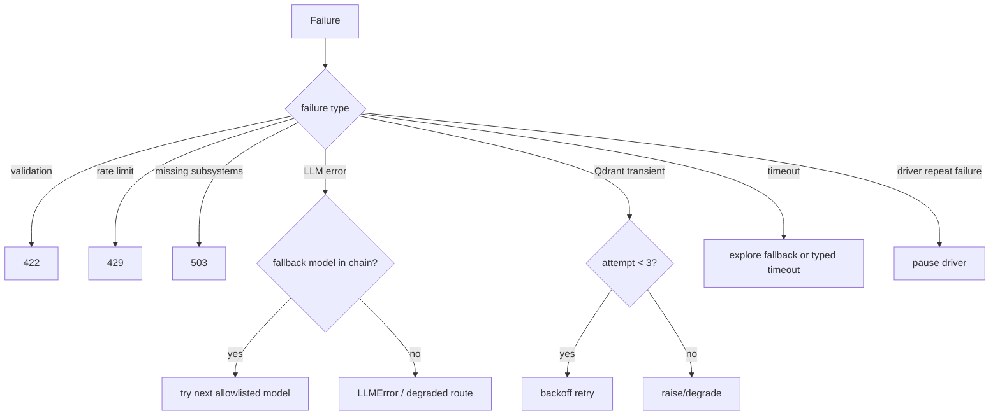

## 15. Background Jobs And Shutdown

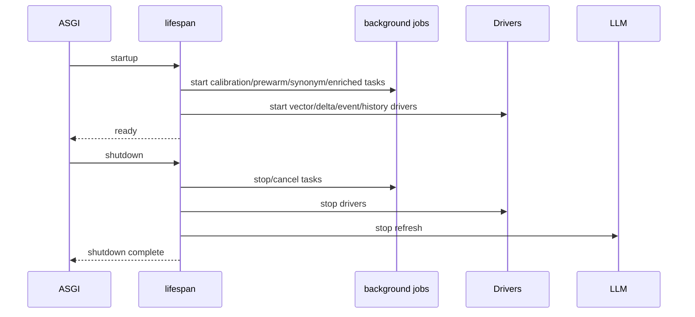

Shutdown stops background jobs, drivers, and LLM refresh only. Signals are **not** flushed on exit: JSONL is append-on-write per `record`; the in-memory ring is discarded. In-flight UAT S3 uploads are best-effort and may not finish on hard stop. Sudden task death (OOM / SIGKILL) loses the ring and any ephemeral local JSONL; completed UAT S3 objects remain.

## 16. Storage And Runtime Summary

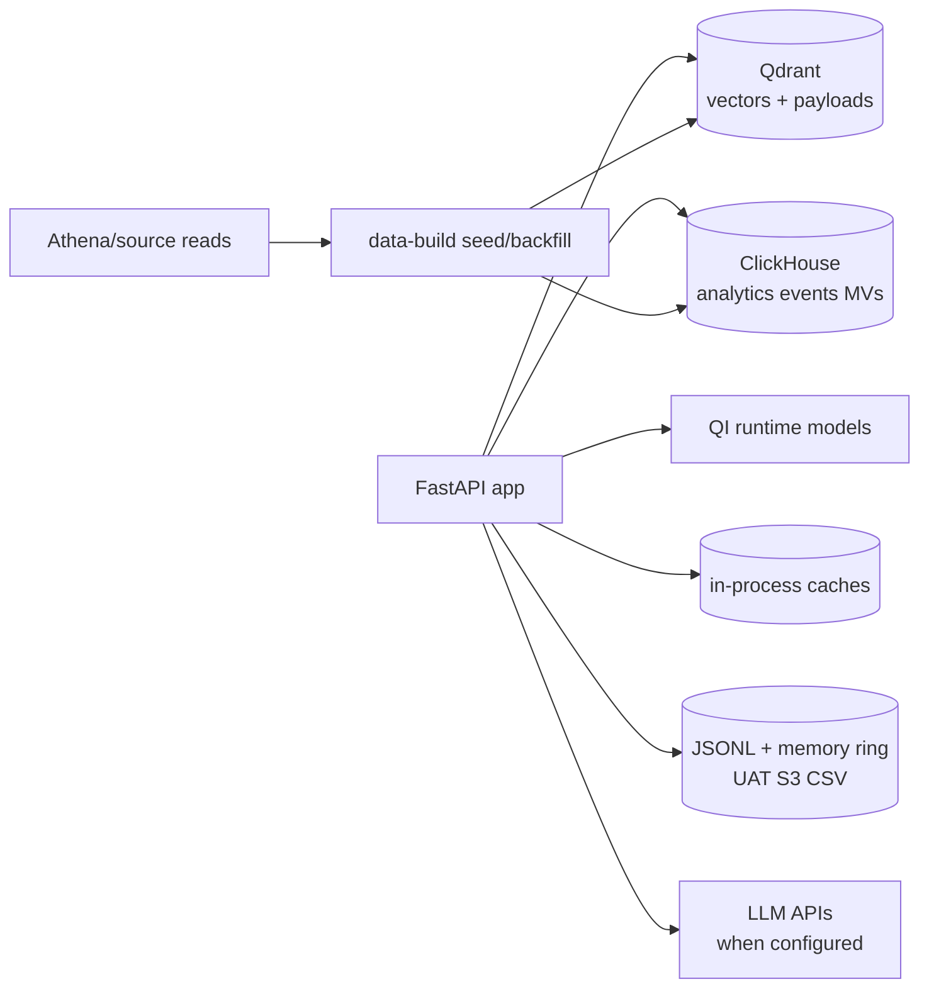

Signals: ring = hot buffer; local JSONL = process/volume path; UAT day-partitioned S3 CSV = durable for `uat_feedback` when upload completes. Retrain / offline learning should prefer durable S3 over local JSONL. Retention knobs: `PLAYBOOK.md` §13.