# Security Posture and Benchmark

## 1. Trust Boundaries

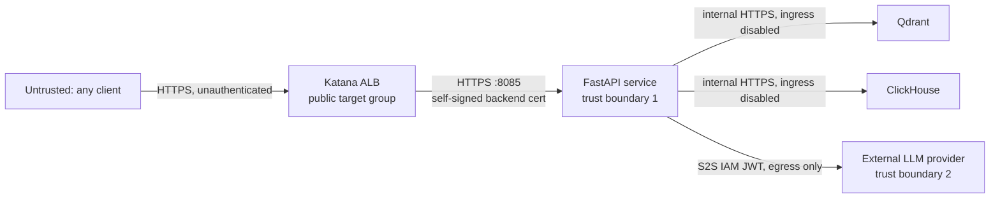

`/search`, `/capabilities`, `/healthz`, and the test-harness route have no app-level
auth — ALB is the only gate. `/feedback` alone carries an app-level secret. No
WAF/IP-allowlist config appears in `configs/katana*.yaml`. [Uncertain: platform-level
authn/WAF not verifiable from source.]

Evidence: `packages/semantic-search/semantic_search/app.py:3156` (`_search_impl`, no auth dependency),
`configs/katana.yaml:102-103` (only outbound S2S JWT, no inbound auth config present).

## 2. CI/CD Security Gates

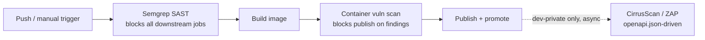

Semgrep runs `--config auto`, uploads SARIF, then re-runs with `--error` — any
finding fails the job, and every downstream job (`needs: semgrep`) is gated on it.
This is why branch `fix/semgrep_fix` exists: a version mismatch broke that gate.

DAST fires `wait: 0` (fire-and-forget) *after* promote — it observes, doesn't gate.
The workflow's own TODO flags `/openapi.json` exposure as unverified, so scan
coverage isn't confirmed by this repo alone (see scorecard #3).

Evidence: `.github/workflows/ci-deploy.yml:47-77` (semgrep job, `needs: semgrep` on jobs 1/3/4),
`.github/workflows/ci-deploy.yml:256-258` (container-scan blocks publish),
`.github/workflows/ci-deploy.yml:288-307` (`Promote` step precedes `Request CirrusScan DAST`; `wait: 0`; the inline TODO on the `/openapi.json` target).

## 3. Transport Security

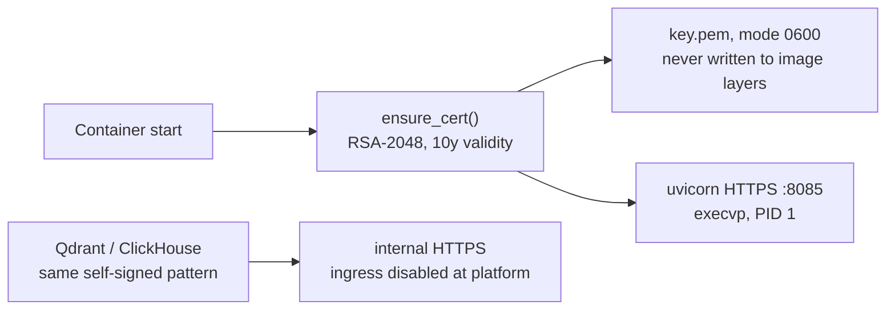

Certs are self-signed, per-task, generated once into the container filesystem.
ALB doesn't validate the backend cert — encryption-in-transit yes, backend
authentication no; documented tradeoff, not an oversight. No rotation beyond
container restart/redeploy.

Evidence: `packages/semantic-search/tls_entrypoint.py:1-58` (self-signed cert, 0600 key perms, comment on why ALB cert validation is skipped),
`docker/qdrant/entrypoint-tls.sh`, `docker/clickhouse/entrypoint-tls.sh` (same pattern for stores).

## 4. Ingress Controls

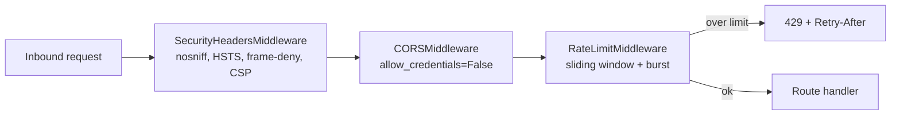

`CORS_ALLOWED_ORIGINS` defaults to `"*"` but pairs with `allow_credentials=False` —
the dangerous wildcard+credentials combo isn't present, so this is a prod hardening
item (pin explicit origins), not a live vuln. Rate limiter buckets by `X-Session-Id`
first, IP second; state is per-pod (no distributed store) — an accepted follow-up per
the module docstring, not a gap found here. `/search` = 120 req/min/session; analytics
path is tighter (30/min) since each call can trigger LLM generation + a warehouse query.

Evidence: `packages/semantic-search/semantic_search/app.py:263-294` (`SecurityHeadersMiddleware`),
`packages/semantic-search/semantic_search/app.py:1811-1821` (CORS wiring),
`packages/semantic-search/semantic_search/middleware/rate_limit.py:1-213` (`SlidingWindowRateLimiter`, `RateLimitMiddleware`),
`packages/semantic-search/semantic_search/config/base.yaml:311-314,346-349`.

## 5. LLM Ingress Safety (Prompt-Injection Defense)

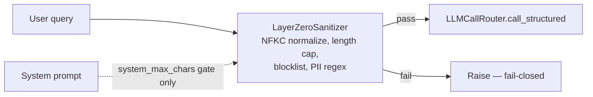

`IngressSanitizer` is fail-closed at the LLM boundary: a match raises immediately
rather than forwarding a masked prompt — per its docstring, a real violation should
surface to the operator, not get quietly laundered.

Evidence: `packages/semantic-search/semantic_search/safety/layer_zero_sanitizer.py:1-85`,
`packages/semantic-search/semantic_search/core/llm_client.py:133-153` (`IngressSanitizer` protocol, fail-closed rationale in the docstring),
`packages/semantic-search/semantic_search/config/base.yaml:4936-4938` (`ingress_sanitizer.max_chars=500`, `system_max_chars=50000`).

## 6. Retrieved-Content Sanitization (RAG-Poisoning Defense)

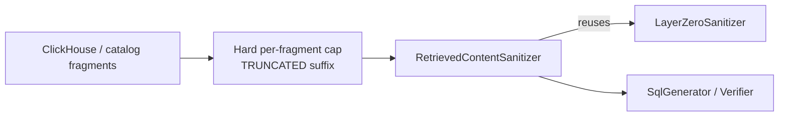

Content pulled from the warehouse into SQL generation/verification prompts is
truncated and passed through the same ingress sanitizer, so a poisoned row value
can't smuggle an oversized or blocklisted payload into the LLM context. Disables
gracefully (returns `None`, logs why) if misconfigured — no silent no-op.

Evidence: `packages/semantic-search/semantic_search/registry.py:1938-1958` (`_build_retrieved_content_sanitizer`),
`packages/semantic-search/semantic_search/nl_to_sql/content_sanitizer.py:64` (`RetrievedContentSanitizer`),
`packages/semantic-search/semantic_search/config/base.yaml:3476-3478`.

## 7. NL→SQL Injection Defense

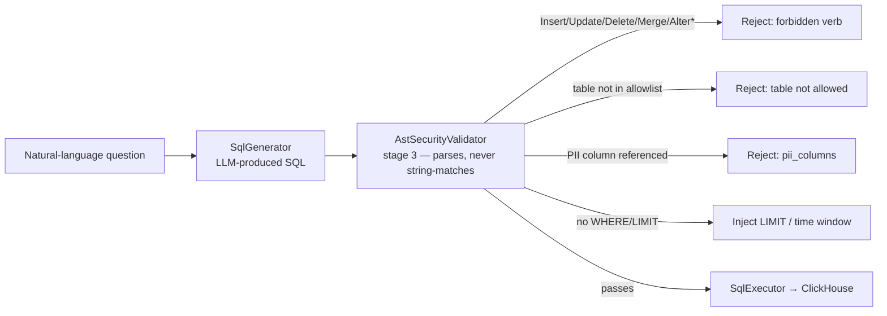

AST-based allowlist, not a regex denylist: forbidden statement types (`Insert`,
`Update`, `Delete`, `Merge`, `AlterTable`, ...) are checked against the parsed tree,
table access is restricted to `allowed_tables`, PII columns are blocked by name, and
unbounded queries get a `LIMIT`/time window injected rather than merely rejected.

Verified against `validate()`: parses via `sqlglot.parse` (real AST, not string
matching), rejects multi-statement input (:112-118), checks forbidden node types at
the AST root *and* recursively via `ast.find(forbidden_cls)` (:133-140 — catches an
`Insert`/`Delete` hidden inside a CTE or subquery), then runs table-allowlist →
PII-column → catalog-column checks before any LIMIT/time-window mutation.

Evidence: `packages/semantic-search/semantic_search/nl_to_sql/security.py:36-45` (`_FORBIDDEN_AST_NAMES`, `_BASELINE_PII_COLUMNS`),
`packages/semantic-search/semantic_search/nl_to_sql/security.py:96-209` (`validate()` — read in full),
`packages/semantic-search/semantic_search/config/nl_to_sql_models.py:191-243` (`SqlSecurityConfig` — non-empty `allowed_tables` enforced at config-load time, not just at query time).

## 8. Egress Safety (Output-Side Guard)

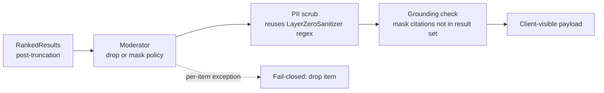

Runs as the final pipeline step, after truncation, so only what the user sees gets
scrubbed. Precedence: `dropped_moderation > pii_masked > explanation_scrubbed > kept`.
A per-item exception anywhere converts to a dropped item rather than risking an
unscrubbed payload; construction-time misconfiguration (missing sanitizer/moderator)
refuses to boot rather than half-wiring.

Evidence: `packages/semantic-search/semantic_search/safety/egress_guard.py:1-416` (`EgressGuard.apply`, `_scrub_item`, fail-closed exception handling at :156-162).

## 9. Endpoint Authentication Posture

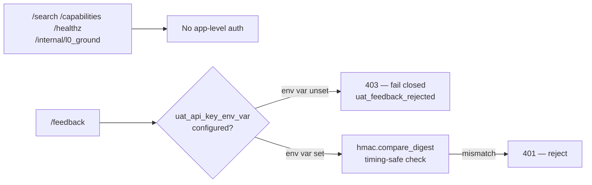

`/feedback` fails closed: if `uat_api_key_env_var` is configured but the env var
itself is empty, the request is rejected with 403 rather than silently accepted —
closes the prior open-write fallback. Logged as `uat_feedback_rejected reason=env_unset`.

Evidence: `packages/semantic-search/semantic_search/app.py:4995-5011` (`submit_feedback`, fail-closed on unset key at :4997, timing-safe compare at :5005),
`packages/semantic-search/semantic_search/config/base.yaml:4685-4714` (`feedback.uat_api_key_env_var: FEEDBACK_UAT_API_KEY`).

## 10. Secrets Management

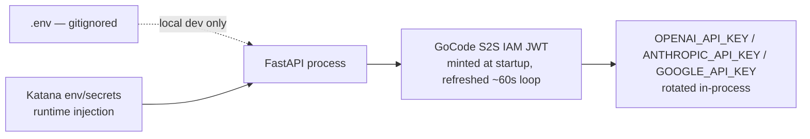

LLM provider keys aren't long-lived static secrets — minted via the ECS task role and
refreshed on a background loop, with `validate_api_keys` + client re-init each refresh;
failures are logged, not fatal.

Evidence: `auc-semantic-search/.gitignore:6-8` (`.env`/`.env.*` excluded, `.env.example` explicitly allowed),
`packages/semantic-search/semantic_search/app.py:1656-1675` (`_refresh_gocode_jwt`, 60s loop, `asyncio.CancelledError` handled on shutdown),
`configs/katana.yaml:102-103`.

## 11. Observability of Safety Controls

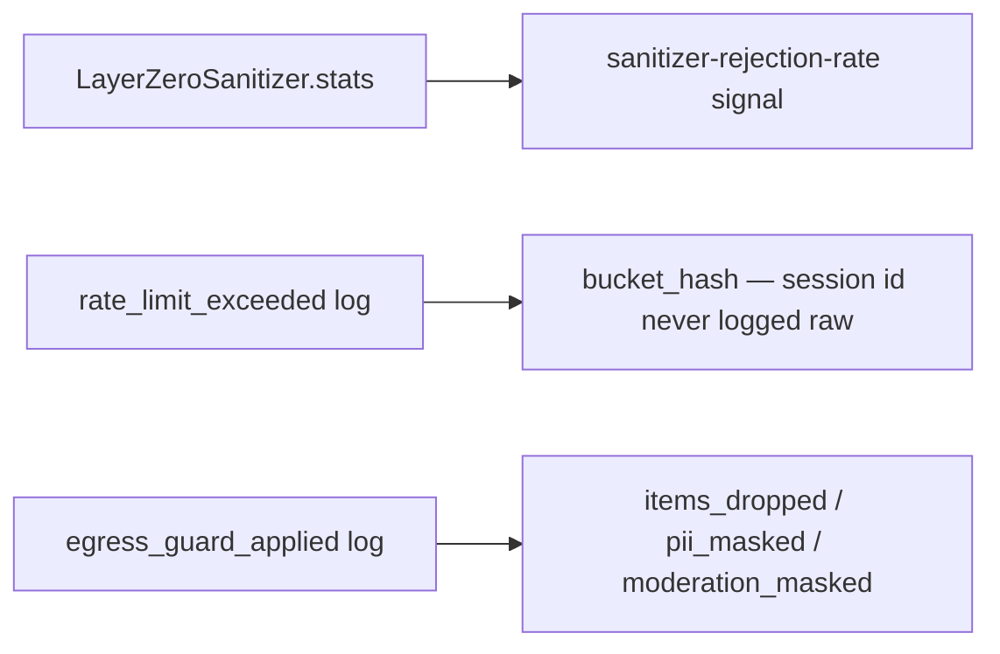

Bucket keys (carrying the session id) are hashed before logging, not logged raw —
a deliberate choice per the inline comment.

Evidence: `packages/semantic-search/semantic_search/middleware/rate_limit.py:194-201` (`bucket_hash`),
`packages/semantic-search/semantic_search/safety/layer_zero_sanitizer.py:47-50` (`stats()`),
`packages/semantic-search/semantic_search/safety/egress_guard.py:201-211`.

## 12. Validation & Benchmark Scorecard

| #   | Control                                               | Status                                                                                                                                                                                | Evidence                                                                                                        | Severity if absent                                       |
| --- | ----------------------------------------------------- | ------------------------------------------------------------------------------------------------------------------------------------------------------------------------------------- | --------------------------------------------------------------------------------------------------------------- | -------------------------------------------------------- |
| 1   | SAST gate (Semgrep) blocking merge                    | ✅ Present, enforced (`--error`)                                                                                                                                                       | `.github/workflows/ci-deploy.yml:47-77`                                                                         | HIGH                                                     |
| 2   | Container image vuln scan blocking publish            | ✅ Present                                                                                                                                                                             | `.github/workflows/ci-deploy.yml:256-258`                                                                       | HIGH                                                     |
| 3   | DAST (ZAP) against live OpenAPI schema                | ⚠️ Present but post-deploy, fire-and-forget (`wait: 0`), dev-private only — runs after promote, doesn't gate it; the workflow's own TODO flags `/openapi.json` exposure as unverified | `.github/workflows/ci-deploy.yml:288-307`                                                                       | MEDIUM                                                   |
| 4   | Transport encryption API↔ALB                          | ✅ Present (self-signed, no backend cert validation by design)                                                                                                                         | `tls_entrypoint.py:1-58`                                                                                        | — (accepted tradeoff)                                    |
| 5   | Security response headers                             | ✅ Present (HSTS, nosniff, frame-deny, CSP)                                                                                                                                            | `app.py:263-294`                                                                                                | MEDIUM                                                   |
| 6   | CORS hardening                                        | ⚠️ Wildcard origin default, but `allow_credentials=False` (not exploitable combo)                                                                                                     | `app.py:1811-1821`                                                                                              | LOW (hardening only)                                     |
| 7   | Rate limiting                                         | ✅ Present, per-pod only (no distributed store — documented, not hidden)                                                                                                               | `middleware/rate_limit.py:1-213`                                                                                | MEDIUM (multi-replica bypass via distribution)           |
| 8   | LLM prompt-injection ingress gate                     | ✅ Present, fail-closed                                                                                                                                                                | `llm_client.py:133-153`, `layer_zero_sanitizer.py:1-85`                                                         | HIGH                                                     |
| 9   | RAG/retrieved-content sanitization                    | ✅ Present, fails safe (returns None + logs)                                                                                                                                           | `registry.py:1938-1958`                                                                                         | MEDIUM                                                   |
| 10  | NL→SQL injection defense                              | ✅ Present, AST-based allowlist (not regex)                                                                                                                                            | `nl_to_sql/security.py:36-45,96-209`                                                                            | CRITICAL                                                 |
| 11  | Output PII/moderation/grounding guard                 | ✅ Present, fail-closed per-item                                                                                                                                                       | `egress_guard.py:1-416`                                                                                         | HIGH                                                     |
| 12  | `/search`, `/capabilities`, `/healthz` app-level auth | ❌ None — relies entirely on the ALB/platform layer, which is not visible from this repo                                                                                               | `app.py:3156` (no auth dependency); [Uncertain] whether a platform-level WAF/allowlist exists outside this repo | HIGH (unverified — platform-level gate not confirmed)     |
| 13  | `/feedback` auth                                      | ✅ Present, fails closed (403) if `FEEDBACK_UAT_API_KEY` unset — no more silent-open fallback                                                                                          | `app.py:4995-5011`                                                                                              | MEDIUM (resolved)                                        |
| 14  | Secret material in git                                | ✅ `.env` gitignored; LLM keys are short-lived, rotated JWTs, not static                                                                                                               | `auc-semantic-search/.gitignore:6-8`, `app.py:1656-1675`                                                       | CRITICAL if reintroduced                                 |

**Net read:** ingress sanitizer → retrieval sanitizer → AST-validated SQL → egress
guard is defense-in-depth and fail-closed at every stage — the strongest part of the
posture. Two open items: (a) confirm whether `/search` is meant to be unauthenticated
at the app layer, or a platform-level gate exists outside this repo; (b) verify
`FEEDBACK_UAT_API_KEY` is actually set wherever `/feedback` is internet-reachable,
since its absence is a silent-by-default open write.